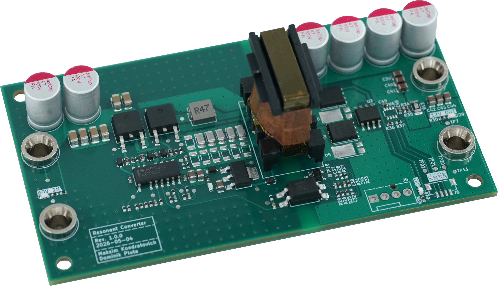

# Resonant Converter

 

  

## Overview

This project is an LLC resonant converter. The power supply is designed to step down a nominal 60V input to a 12V output, capable of delivering up to 10A of continuous current (120W).

The board features power telemetry using an INA219 sensor, which can be easily interfaced via a standard QWIIC connector.

### Key Features

* **Input Voltage:** 60V ± 5%
* **Output:** 12V @ 10A
* **Topology:** LLC Resonant Converter
* **Telemetry:** Onboard INA219 power monitor with a QWIIC I2C connector
* **Magnetics:** Custom-wound transformer

## Project Status

**Design:** ✅ → **Fabrication & Assembly:** ✅ → **Bring-up:** ✅

> [!IMPORTANT]
> **Hardware modification required (rev.1.0.0):**
>
> Replace `R20` with a diode (e.g. `1N4148`) to prevent VCCP from backfeeding `U3`. Without this fix, VCCP remains too low for the LLC controller `U1` to start up.

## Used Tools

* [KiCad](https://www.kicad.org/) - Schematic and PCB design
